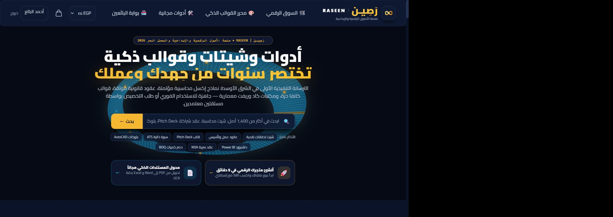

# Mohamed Helmy — Creative Technologist & Full-Stack Architect

<p align="center">
  
</p>

<p align="center">
  <strong>Crafting high-conversion digital flagships, bespoke brand identities, and AI-accelerated web systems.</strong>
</p>

<p align="center">
  <a href="https://wa.me/201090641737?text=Hello%20Mohamed,%20I'd%20like%20to%20discuss%20a%20project">
    
  </a>
  <a href="mailto:mohamedalghala@gmail.com">
    
  </a>
  
  
  
</p>

---

## 🏛️ Selected Flagship Works

| Project | Domain | Key Technology | Live Demo / Preview |
| :--- | :--- | :--- | :--- |
| **Brasil Chic** | High-Fashion E-Commerce | Next.js, Custom Checkout, Micro-Animations | [Live Preview](https://brazil-fashion-store.vercel.app) |
| **AURA Glow Up** | Luxury Fragrance & Beauty | EasyOrders API, Live Color Swatches, Shatr AI | [auraglowup.online](https://auraglowup.online) |
| **SOLVO Performance** | Premium Automotive Hub | Next.js, Dynamic Filtering, Brand Theming | [Live Preview](https://solvo-store.vercel.app) |
| **Tourvanto** | International VIP Excursions | Next.js, Multilingual Architecture, Booking Engine | [Live Preview](https://tourvanto.vercel.app) |
| **Raseen Vault** | Digital Assets & Creator Economy | Full-Stack Platform, CAD/Excel File Inspectors, Watermarking | *Private Alpha / Coming Soon* |
| **Cortex AI Factory** | Cloud Video Automation Pipeline | Python, Edge TTS, FFmpeg, Cloud Run | Open Architecture |

---

## ⚡ Architectural Highlights

- **Aesthetic Register:** Bespoke "Noir & Champagne" luxury editorial palette (`#090B0C`, `#F2EDE4`, `#C8A96A`).
- **Portal Hero:** Split-panel reveal curtain with 16:9 cinematic framing.
- **Bento Project Grid:** Dynamic hover glows matching the signature color of each individual brand.
- **Interactive WhatsApp Funnel:** Zero-friction inquiry modal with instant quote generation and pre-filled message encoding.
- **Performance:** 100% static export compatibility, zero layout shift, sub-second TTFB.

---

## 🚀 Quick Start (Local Development)

```bash
# Clone the repository
git clone https://github.com/MohamedElghala/mohamed-helmy-portfolio.git

# Enter project directory
cd mohamed-helmy-portfolio

# Install dependencies
npm install

# Start local development server
npm run dev
```

Visit `http://localhost:3000` to preview.

---

## 📬 Contact & Engagements

- **WhatsApp:** [+20 1090641737](https://wa.me/201090641737)
- **Direct Email:** [mohamedalghala@gmail.com](mailto:mohamedalghala@gmail.com)
- **Location:** Cairo, Egypt (GMT+3) • Open to global remote contracts.
